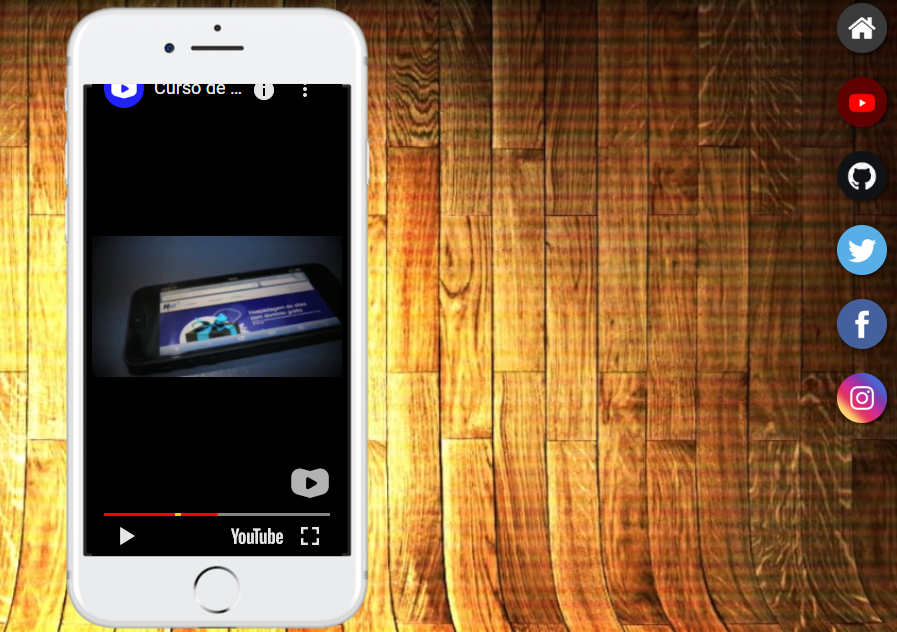

<h1> Redes - Sociais</h1>

este projeto foi feito no intuito de simular um site na onde seu usuário pode colocar todas as sua redes sociais fazendo uma espécie de link personalizado

<h2>Tecnologias usadas neste site </h2>

 para a construção foi utilizada somente HTML5 e CSS3, muito provavelmente ele sofrera algum tipo de alteração futura , site usando a modelo mobile frist então pode ser que acha algum tipo de em inconveniência em seu dispositivo por conta do tamanho de sua tela 

<h3> exemplo de como o projeto fica em uma tela de notebook</h3>

<h3>link do projeto</h3>

<a href="https://lucaskawatoko.github.io/minhas-redes-sociais/">https://lucaskawatoko.github.io/minhas-redes-sociais/</a>